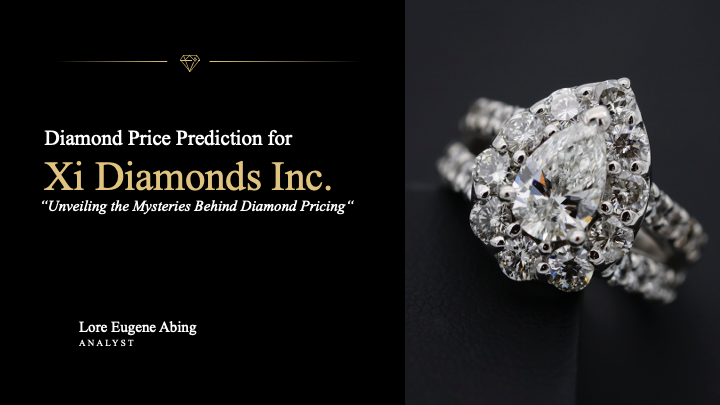

# Diamond Price Prediction for Xi Diamonds Inc.

### Business Problem

**Background**

Xi Diamonds Inc. is a major diamond retailer with a vast online presence. Over the years, they have accumulated data on diamond sales, capturing attributes like carat, cut, color, clarity, and depth of thousands of diamonds they've sold. The company aims to understand the key drivers behind the pricing of diamonds to make informed business decisions, such as procurement, pricing strategy, and marketing.

**Problem Statement:**

Recently, there has been a fluctuation in the price of diamonds in the global market. Xi Diamonds Inc. wants to know:

1. Which attributes significantly impact the price of a diamond?
2. By how much does a change in each of these attributes alter the diamond's price?

This understanding will allow the company to set competitive prices, strategize their marketing efforts, and communicate value propositions more effectively to their customers.

## Interpretation

1. Carat: For every 1% increase in the size of the diamond (carat), the price increases by approximately 108% on average, holding other factors constant.
2. Cut, Color, and Clarity: Diamonds with better cuts, colors, and clarity grades tend to fetch higher prices, as evident from their positive coefficients.
3. Depth: Although total depth was included in the model, its influence on price wasn't statistically significant based on the given dataset.

## Recommendations:

1. Inventory Procurement: Focus on procuring diamonds that align with attributes customers value the most, i.e., carat, cut, color, and clarity.
2. Marketing and Communication: Emphasize the quality and size (carat) in marketing campaigns as they significantly influence the price and perceived value.
3. Pricing Strategy: Be ready to adjust diamond prices in line with their carat, especially since it has a significant multiplicative effect on the price.
4. Further Research: Since the depth of the diamond didn't significantly impact the price, further qualitative research might be useful to understand if and why customers value depth.